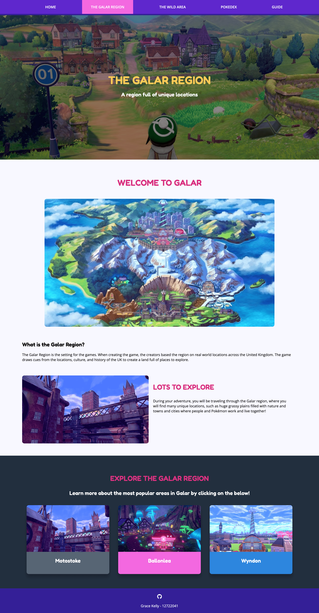
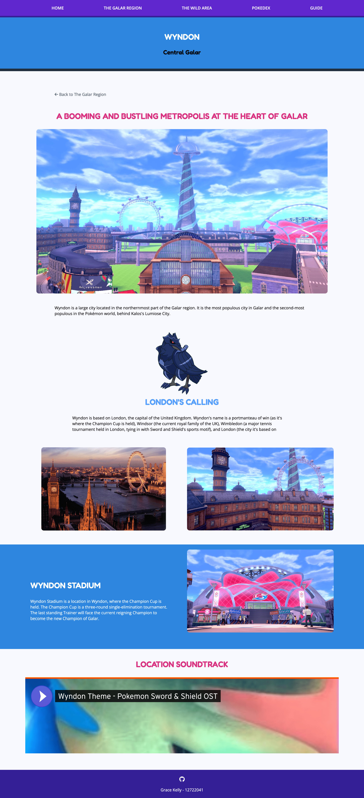
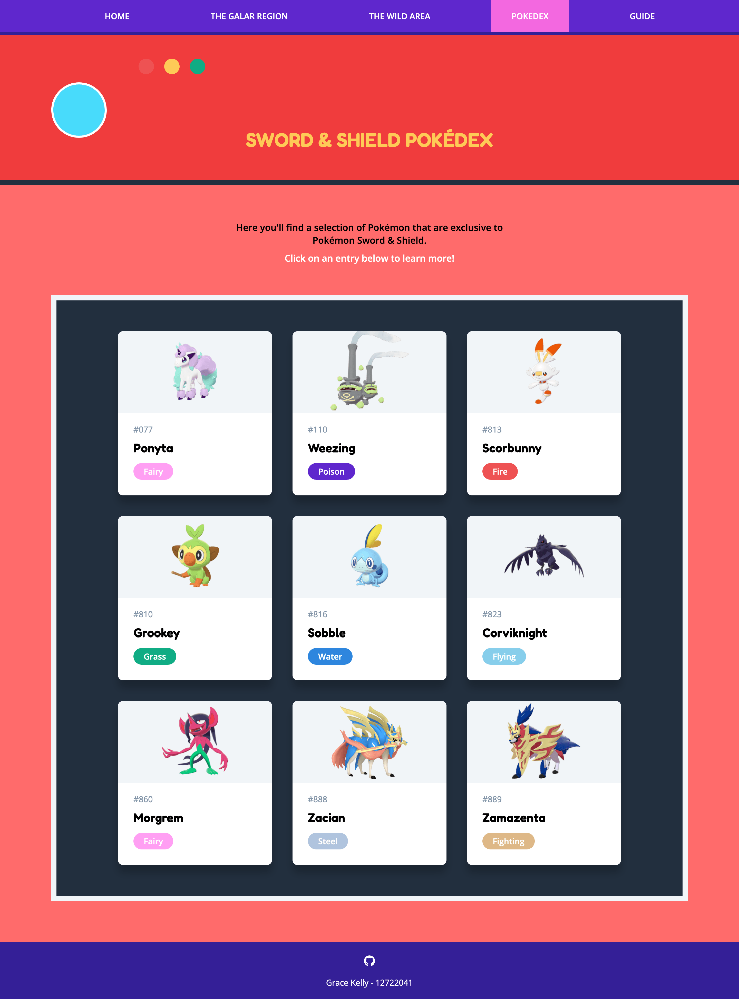
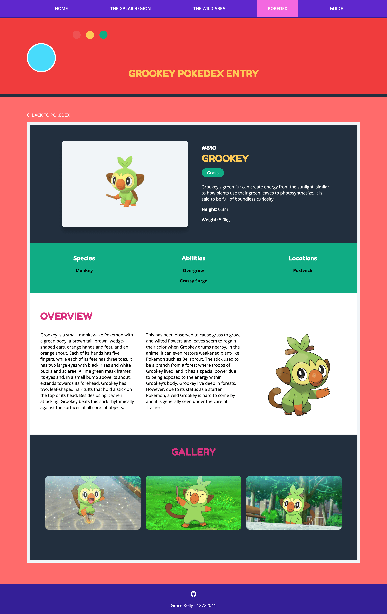

# Web Development Assignment 1
### Grace Kelly - 12722041

## Goal of Website
The goal of this website is to use the HTML and CSS technologies learned in Web Development
class and apply them into making a website. I also wanted to be able to use the 
Nunjucks Templating Language and be able to deploy the site using Github Pages.

## About Website

### Topic
This website is on the topic of Pokémon Sword & Shield - video games
that were launched on the Nintendo Switch which I recently had played.

### Technologies Used

- HTML
- CSS
- Nunjucks
- Eleventy
- Github

### How to View
The website can be viewed [here](https://gracielily.github.io/webproject/)

### How to run the project locally

1. Clone into the repo or download the source code and cd into the `webproject` folder
2. Ensure [eleventy](https://www.11ty.dev/) is installed on your local machine.
3. Run the following commands:
```angular2html
npm install
eleventy --serve
```
4. Visit the site at the port specified in the output

## Website Contents

<details>
  <summary>Folder Structure</summary>

  Below is the folder structure for the website:

```
├── _includes
│   ├── _globals.njk
│   ├── footer.njk
│   ├── header.njk
│   ├── heading.njk
│   ├── layout.njk
│   ├── navigation.njk
│   └── pokedex.njk
├── _site
│   ├── css
│   ├── galar-region
│   ├── guide
│   ├── img
│   ├── index.html
│   ├── pokedex
│   └── wild-area
├── css
│   ├── common.css
│   ├── galar.css
│   ├── guide.css
│   ├── pokedex.css
│   └── wild-area.css
├── img
│   ├── gymleaders
│   ├── locations
│   ├── pokeballs
│   ├── pokemon
│   └── wild-area
├── galar-region
│   ├── ballonlea.njk
│   ├── index.njk
│   ├── motostoke.njk
│   └── wyndon.njk
├── guide.njk
├── index.njk
├── pokedex
│   ├── corviknight.njk
│   ├── grookey.njk
│   ├── index.njk
│   ├── morgrem.njk
│   ├── ponyta.njk
│   ├── scorbunny.njk
│   ├── sobble.njk
│   ├── weezing.njk
│   ├── zacian.njk
│   └── zamazenta.njk
└── wild-area.njk
```
</details>

<details>
  <summary>Page Structure</summary>

  There are 17 pages in total:

- Home Page ([link](https://gracielily.github.io/webproject/))
- The Galar Region ([link](https://gracielily.github.io/webproject/galar-region))
  - Motostoke ([link](https://gracielily.github.io/webproject/galar-region/motostoke))
  - Ballonlea ([link](https://gracielily.github.io/webproject/galar-region/ballonlea))
  - Wyndon ([link](https://gracielily.github.io/webproject/galar-region/wyndon))
- The Wild Area ([link](https://gracielily.github.io/webproject/wild-area))
- Pokedex ([link](https://gracielily.github.io/webproject/pokedex))
  - Ponyta ([link](https://gracielily.github.io/webproject/pokedex/ponyta))
  - Corviknight ([link](https://gracielily.github.io/webproject/pokedex/corviknight))
  - Grookey ([link](https://gracielily.github.io/webproject/pokedex/grookey))
  - Scorbunny ([link](https://gracielily.github.io/webproject/pokedex/scorbunny))
  - Sobble ([link](https://gracielily.github.io/webproject/pokedex/sobble))
  - Weezing ([link](https://gracielily.github.io/webproject/pokedex/weezing))
  - Morgrem ([link](https://gracielily.github.io/webproject/pokedex/morgrem))
  - Zacian ([link](https://gracielily.github.io/webproject/pokedex/zacian))
  - Zamazenta ([link](https://gracielily.github.io/webproject/pokedex/zamazenta))
- Guide ([link](https://gracielily.github.io/webproject/guide))
</details>

<details>
<summary>A Selection of Screenshots</summary>

#### Home Page


#### The Galar Region


#### Galar Region Location - Wyndon


#### The Wild Area


#### Pokedex


#### Pokedex Entry


</details>


